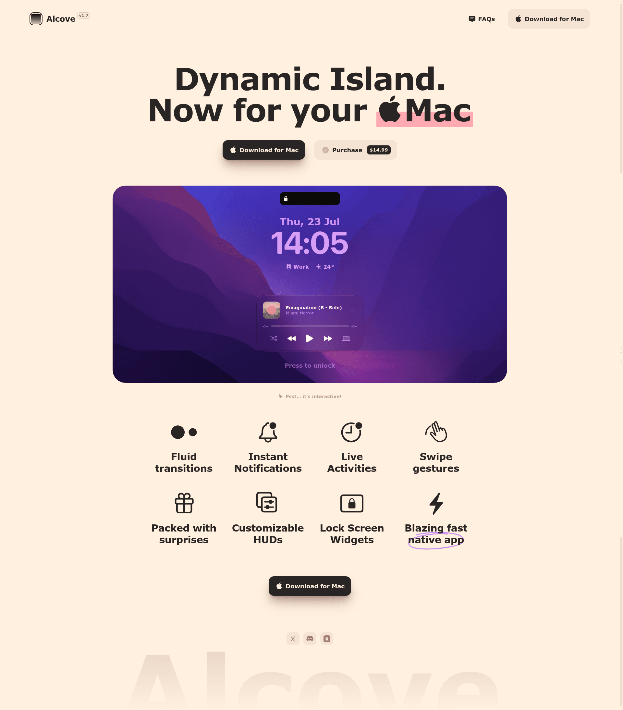

# Wake My Mac web design

## Source

- Reference: https://tryalcove.com/
- Captured: 2026-07-23 via Firecrawl branding, image, page-content, and full-page screenshot scrapes
- Local scrape evidence: `../.firecrawl/alcove-branding-fresh.json`, `../.firecrawl/alcove-screenshot-fresh.json`, `../.firecrawl/alcove-screenshot-fresh.png`
- Privacy reference captured 2026-07-24: `../.firecrawl/alcove-privacy-branding.json`, `../.firecrawl/alcove-privacy-screenshot.json`, `../.firecrawl/alcove-privacy-screenshot.png`

## Reference screenshot



Use this screenshot as the source of truth for hierarchy, density, and feel. Reuse the design language, not Alcove's copy, logo, imagery, or product-specific decoration.

## Design direction

Refined, native-feeling Mac utility marketing: warm paper background, dark ink, compact navigation, an oversized centered two-line promise, paired actions, and one large rounded product visual. The site should feel direct, friendly, quietly playful, and conversion-focused.

## Tokens

- Paper: `#FFF0DF`
- Ink: `#292524`
- Secondary text: `#705F54`
- Peach action: `#F6E5D4`
- Product accent: `#D8FF4F`
- Borders: `rgba(41, 37, 36, .17)`
- Body and display: rounded system sans stack; 700–800 weight for headings
- Hero heading: approximately 96px at 1920px, tightly led and centered
- Section container: approximately 1740px for navigation and 1220px for the product visual
- Radius: 16px controls, 32–40px product visual
- Shadow: only on the primary dark CTA; no generic card shadows

## Components

- Header: brand icon, wordmark and tiny version badge on the left; one plain link and one peach download button on the right
- Hero: no eyebrow or card; one enormous centered statement with a single playful highlighted phrase
- Actions: dark primary download button with Apple mark, light secondary source button
- Product visual: the real application screenshot at large scale, directly on the paper background

## Content style

Use very short, concrete phrases. Lead with the result, not the mechanism. Keep supporting copy to one sentence and button labels literal.

## Page pattern

Full page: compact header → oversized centered promise → one-line explanation → paired CTAs → large dashboard visual → spacious 4×2 capability grid → centered final download CTA → oversized faded wordmark footer.

Privacy page: dark ink background → compact shared header → oversized left-aligned policy title → one plain privacy statement → short contact block → social links → faded wordmark footer. On the landing page, the brand square reveals a lock and links to privacy; on the privacy page it reveals a back arrow and returns home.

## Agent build instructions

Keep copy short and specific. Use semantic sections, descriptive metadata, JSON-LD SoftwareApplication schema, sitemap, robots, responsive layout, keyboard-accessible controls, and reduced-motion support. Use original Wake My Mac copy and visuals; do not reuse Alcove branding, logo, or third-party imagery.

## Rerun inputs

```text
workflow: firecrawl-website-design-clone
source_url: https://tryalcove.com/
target_stack: Next.js
output: web/DESIGN.md
```
